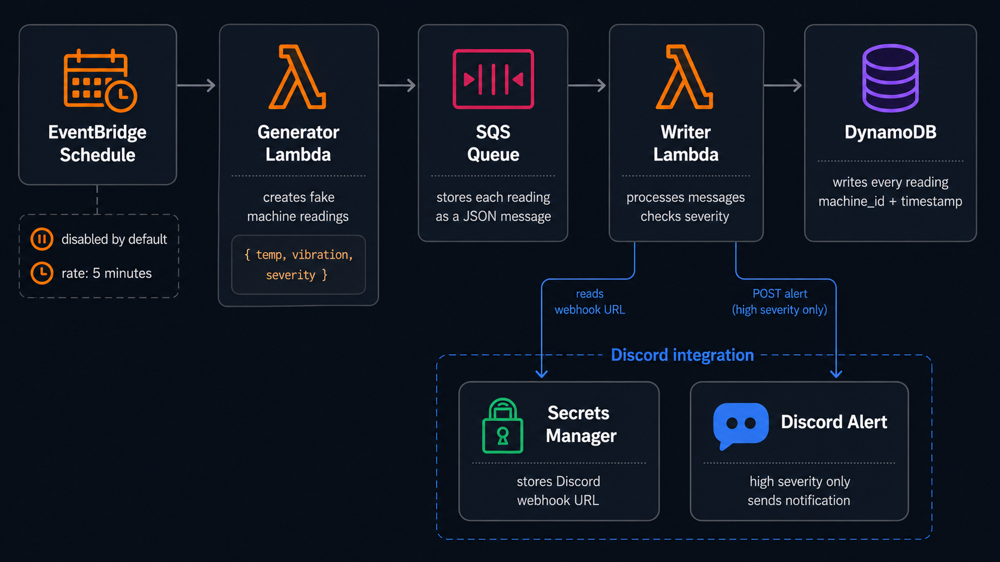
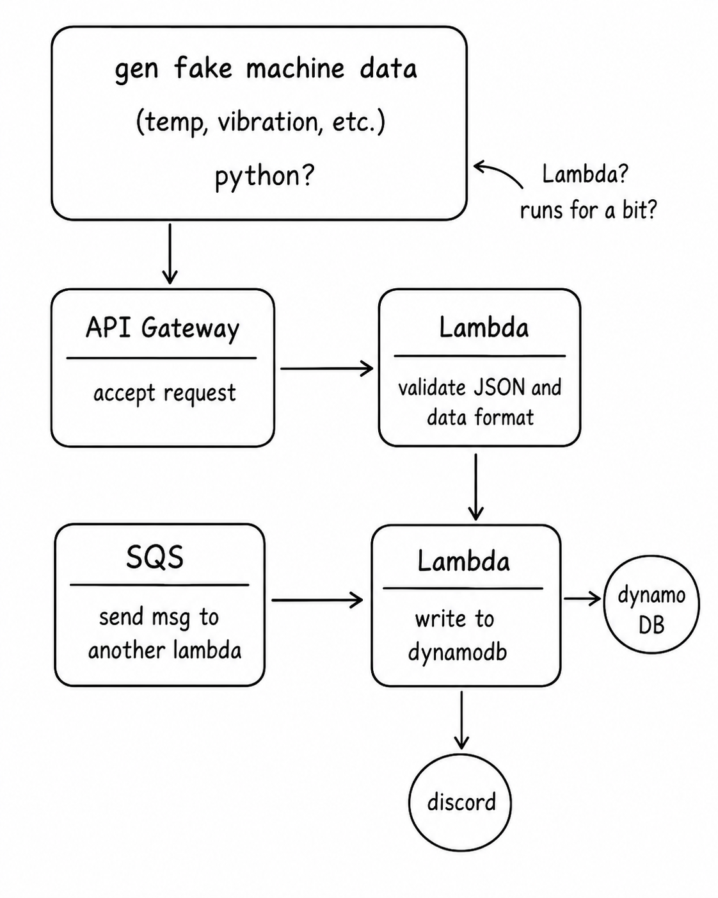

# aws-ingestion

Event-driven AWS ingestion pipeline for simulated machine telemetry.

The project generates fake machine readings, buffers them through SQS, stores them in DynamoDB, and sends an optional Discord alert when a high-severity reading comes in. Infrastructure is defined with Terraform and the Lambda handlers are written in Python.

## Architecture



The main path is intentionally small: EventBridge can trigger a generator Lambda, generated readings are sent as SQS messages, and a writer Lambda persists every reading to DynamoDB. Discord alerts are a side path from the writer Lambda and only run for high-severity readings.

The Discord webhook URL is stored in Secrets Manager. It is not hardcoded in the Lambda code, Terraform, or repository.

## What This Covers

- Scheduled serverless workloads with EventBridge and Lambda
- Queue-based decoupling with SQS and a DLQ
- DynamoDB writes with idempotency checks
- Secrets Manager for webhook configuration
- Best-effort external alerts that do not break ingestion
- Terraform-managed AWS infrastructure

## How It Works

1. `aws-ingestion-generator` creates fake machine readings.
2. Each reading is sent to `aws-ingestion-readings-queue` as a JSON message.
3. `aws-ingestion-writer` consumes SQS messages in batches.
4. The writer stores every reading in DynamoDB.
5. If `severity == "high"`, the writer reads the Discord webhook URL from Secrets Manager and sends an alert.

Example generated reading:

```json
{
  "reading_id": "discord-test-001",
  "machine_id": "machine-999",
  "timestamp": "2026-07-05T21:10:00Z",
  "temperature_f": 101.5,
  "vibration_mm_s": 0.31,
  "pressure_psi": 59.2,
  "rpm": 1880,
  "severity": "high"
}
```

## AWS Resources

Terraform creates:

- DynamoDB table: `aws-ingestion-readings`
- SQS queue: `aws-ingestion-readings-queue`
- SQS DLQ: `aws-ingestion-readings-dlq`
- Generator Lambda: `aws-ingestion-generator`
- Writer Lambda: `aws-ingestion-writer`
- EventBridge schedule: disabled by default
- Secrets Manager secret: `aws-ingestion/discord-webhook`

## Deploy

From `infra`:

```powershell
terraform init
terraform apply
```

The generator schedule is disabled by default so the project does not keep producing data after a test run.

To run it on a timer, change the EventBridge rule state in `infra/main.tf`:

```hcl
state = "ENABLED"
```

Then apply:

```powershell
terraform apply
```

Switch it back to `DISABLED` and apply again when testing is done.

## Discord alerts

Set the webhook secret after Terraform creates the secret:

```powershell
aws secretsmanager put-secret-value `
  --region us-east-1 `
  --secret-id aws-ingestion/discord-webhook `
  --secret-string "https://discord.com/api/webhooks/..."
```

The writer accepts either a raw webhook URL:

```text
https://discord.com/api/webhooks/...
```

or a JSON object:

```json
{"url":"https://discord.com/api/webhooks/..."}
```

Only high-severity readings send Discord alerts. Alert failures are logged, but they do not fail the ingestion path.

That means this still succeeds even if Discord has a temporary issue:

```text
SQS message -> writer Lambda -> DynamoDB write
```

## Test a high-severity alert

Send a known high-severity message directly to SQS:

```powershell
$queueUrl = aws sqs get-queue-url `
  --region us-east-1 `
  --queue-name aws-ingestion-readings-queue `
  --query QueueUrl `
  --output text

aws sqs send-message `
  --region us-east-1 `
  --queue-url $queueUrl `
  --message-body '{"reading_id":"discord-test-001","machine_id":"machine-999","timestamp":"2026-07-05T21:10:00Z","temperature_f":101.5,"vibration_mm_s":0.31,"pressure_psi":59.2,"rpm":1880,"severity":"high"}'
```

Then check:

- DynamoDB for the inserted reading
- Discord for the alert
- CloudWatch logs for `/aws/lambda/aws-ingestion-writer`

## Cost Notes

At the default disabled schedule, the only meaningful standing cost is the Secrets Manager secret, which is roughly cents per day. With the schedule enabled every five minutes, this project is still small enough that Lambda, SQS, and logs should stay within typical free-tier usage for light testing.

The schedule should still be disabled when it is not being tested.

## Cleanup

Disable the schedule before walking away:

```hcl
state = "DISABLED"
```

Then apply:

```powershell
terraform apply
```

To remove the AWS resources:

```powershell
terraform destroy
```

## Design Sketches

The final version started as a quick hand-drawn event flow, then got cleaned up into a more readable sketch before the Terraform and Lambda wiring settled.

<table>
  <tr>
    <td width="50%">
      
    </td>
    <td width="50%">
      
    </td>
  </tr>
  <tr>
    <td align="center">Original sketch</td>
    <td align="center">Readable sketch</td>
  </tr>
</table>
